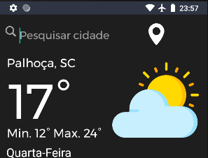
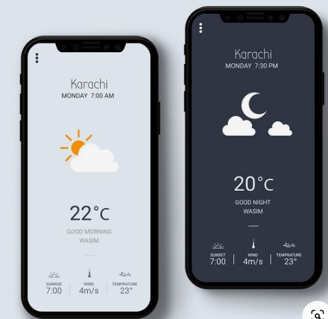
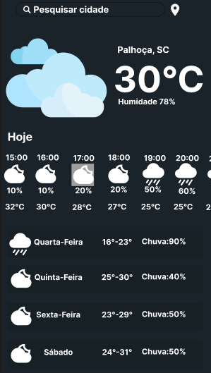
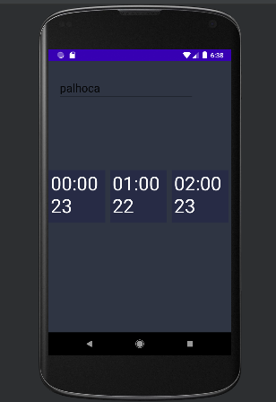
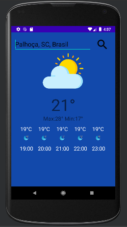
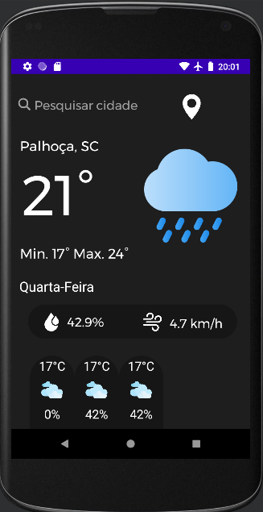
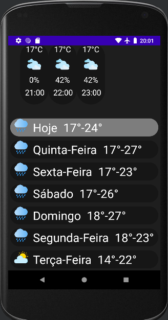

# Climating   
Aplicativo programado em java utilizando a IDE Android Studio. 
Este aplicativo tem como objetivo proporcionar acesso rápido e fácil ao clima atual de milhares de cidades ao redor do mundo.
## Funcionalidades do projeto:
- `Pesquisa por cidade`: O usuário é capaz de fazer consultas a
diferentes cidades. 
- `Localização atual`: O usuário pode optar por pegar sua atual
localização.
## Usabilidade:
 O aplicativo possui uma interface bem intuitiva, sendo assim, o
mesmo é capaz de ser utilizado por pessoas que vão desde os jovens que
possuem grande contato com a tecnologia a até mesmo pessoas de mais
idade que possuem baixo contato.   
 Ao pesquisar a localidade de preferência, o aplicativo se separa em
três diferentes partes:  
•  A primeira mostra o nome da localização pesquisada e o dia da semana, mostra também os dados climáticos atuais como:Temperatura atual,Temperatura mínima e
máxima,precipitação e velocidade do vento.  
•  Na segunda parte, é mostrado os dados climáticos das próximas horas do dia, que são separados em temperatura,precipitação e horário. 
•  Na terceira e última parte, é mostrado uma prévia geral dos próximos 6 dias. Ao clicar em alguma das prévias, os dados da primeira
e segunda parte são modificados para os dadosclimáticos do dia correspondente. 

O software não possui requisito de permissões para funcionamento, porém ao iniciar o aplicativo, é pedido a permissão para acessar a localização, caso o usuário julgue que não seja algo necessário, o mesmo pode recusar sem problemas de funcionamento principal. A permissão que é requisitada, possibilita ao usuário pegar de maneira automática sua
localização atual apenas com o clique de um botão.

# Utilização:

O software possui duas principais funções, sendo elas:
`Pesquisa por cidade`: Na parte superior da tela, se encontra o campo “Pesquisar cidade”, quando selecionado, abre-se o teclado para que o usuário possa digitar o local desejado.
	O aplicativo não possui um botão na tela para confirmação, mas utiliza o próprio botão de “Enter” do teclado para facilitar na usabilidade e deixar a interface mais amigável. 
Caso a cidade pesquisada não exista ou haja um erro de escrita, o código trata esta exceção sem prejudicar os dados já presentes na tela e retorna um feedback para o usuário. 

`Localização atual`: O botão para pegar a localização atual do dispositivo se encontra ao lado do campo “Pesquisar cidade”, na parte superior da tela e possui um ícone de alfinete.  
Pensado como um instrumento que ajude a aumentar a usabilidade do aplicativo, caso a permissão necessária seja concedida, com apenas um clique, esta funcionalidade permite que o usuário pegue de maneira rápida os dados climáticos da cidade que o dispositivo se encontra. 

##### Parte da interface que mostra a localização das funcionalidades citadas a cima.

# Ideia Inicial X Produto Final:
	
No que se refere às diferenças da ideia inicial e do produto final, o principal foi as mudanças visuais e algumas poucas mudanças de funcionalidades.Para começar o projeto, foi pego um exemplo de interface. 
Logo após, foi feito um esboço no figma, que pegou apenas como base algumas ideias do exemplo. 

##### Exemplo de interface ------------------------------- Esboço feito no figma
 
Logo após, começou o desenvolvimento e durante o processo, algumas ideias mudaram e outras nasceram. 
##### Fotos do processo de desenvolvimento.
 
Depois de mudar alguns aspectos visuais como:Cor de fundo, cor das letras, posição dos ícones, posição das informações, informações adicionais e troca de informações, o visual final ficou bem diferente do inicialmente esperado. 
 

# Desenvolvimento:
### Tecnologias usadas:
IDE: <a href="https://developer.android.com/studio?gclid=CjwKCAjwge2iBhBBEiwAfXDBR_u5cs4xN04gx0zhI1S2DpwHvndmX_SAuCc8uib4bt62yNvArqXtGRoCZIoQAvD_BwE&gclsrc=aw.ds">Android Studio</a>, Versão:11.0.15+0-b2043.56-9505619 amd64. 
Linguagem: <a href="https://www.java.com/pt-BR/">Java<a/>. 
API:<a href="https://www.java.com/pt-BR/">Visual Crossing<a/>.

### Dificuldades Enfrentadas:
Logo no começo do desenvolvimento, a primeira dificuldade foi fazer a conexão do aplicativo com a API de tempo. Devido as constantes atualizações do Android Studio, os comandos que executam a conexão mudaram nos últimos meses.Graças a quantidade de informação presente na internet, acabou demorando para que o código certo fosse encontrado e a requisição fosse feita de maneira correta.Outra dificuldade encontrada foi na questão de tratamento de dados. Ao fazer a requisição, a API me retorna uma String com a formatação JSON. A dificuldade foi devido a grande quantidade de informações presentes nesta resposta,  na média seu tamanho é de 140kB, pode parecer pouco,mas se colocarmos que cada caractere possui 1 byte, possuímos então, cerca de 140 mil caracteres de resposta em uma única requisição.
	
### Código:
Por mais que este seja um projeto relativamente pequeno, falando de maneira técnica, o software em si possui diversas funcionalidades. Com quase 700 linhas, o código possui diversas bibliotecas importadas, funções, variáveis de conteúdo, variáveis de verificação, tratamento de exceções entre outros.

# Documentação de código:

### Permissões:
Para que o aplicativo final funcione, ele necessita de conexão com a internet para que a requisição seja feita a API e para uma funcionalidade secundária, necessita da permissão para acessar a localização do dispositivo ,com isso, foi necessário adicionar algumas permissões no arquivo “AndroidManifest.xml”, as adições foram: 
`<uses-permission android:name="android.permission.ACCESS_NETWORK_STATE"/>` 
`<uses-permission android:name="android.permission.INTERNET"/>` 
`<uses-permission android:name="android.permission.ACCESS_COARSE_LOCATION" />` 
`<uses-permission android:name=android.permission.ACCESS_FINE_LOCATION/>` 
	
As duas primeiras permissões possuem como objetivo possibilitar que o código faça conexão com a internet e não necessita da confirmação do usuário. As duas últimas permissões possibilitam que o aplicativo pegue a posição geográfica em Longitude e Latitude do dispositivo, porém é necessário que o usuário tenha consentimento do mesmo e confirme sua permissão. 

### Bibliotecas:
Na questão das bibliotecas utilizadas, 42 bibliotecas foram importadas, a grande maioria são padrões do próprio android studio, porém algumas bibliotecas são externas. Estas bibliotecas foram declaradas no arquivo “build.gradle” dentro de dependencies:
- Para as bibliotecas de localização 
`implementation'com.google.android.gms:play-services-location:21.0.1'` 
- Para as bibliotecas de JSON 
`implementation 'org.apache.httpcomponents:httpcore:4.4.13'` 

Com essas duas dependências inseridas no build, foi então capaz de importar as seguintes bibliotecas:
- Estas bibliotecas servem para pegar a localização do dispositivo.  
`import com.google.android.gms.tasks.OnFailureListener;` 
`import com.google.android.gms.location.FusedLocationProviderClient;` 
`import com.google.android.gms.location.LocationServices;` 
- Estas bibliotecas servem para tratar a resposta da API que vem em formato JSON. 
`import org.json.JSONArray;` 
`import org.json.JSONException;` 
`import org.json.JSONObject;` 

# Código:
 O projeto possui dois arquivos de códigos, um sendo “Conexao.java” que possui os comandos necessários para que seja feita a requisição para a API. O arquivo de código principal, possui toda a lógica necessária para que o aplicativo funcione e o mesmo está documentado por meio de comentários presentes no código.

